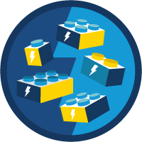

## Hi there 👋, I'm Oyin

**I'm a Salesforce Admin + Developer committed to life-long learning and solving business challenges**

- 🌱 I’m currently learning **Salesforce Development**
  
- 👯 I’m looking to collaborate on Salesforce projects.
  
- 💬 Ask me about **CRM operations and Salesforce**

## Salesforce Technologies

<table width="100%" style="border:0px;">
<tr style="border:0px;" >
  <td align="center" style="border:0px;">
      
       
      <b>Flows</b>
  </td>
  <td align="center" style="border:0px;"> <b>Apex</b></td>
   <td align="center" style="border:0px;"> <b>SOQL</b></td>
  <td align="center" style="border:0px;"> <b>LWC</b></td>
  <td align="center" style="border:0px;"> <b>SFDX</b></td>
 
  <td align="center" style="border:0px;"> <b>Integration</b></td>
</tr>
</table>

## Languages and Tools

           

<!--
**Oyinfunke/Oyinfunke** is a ✨ _special_ ✨ repository because its `README.md` (this file) appears on your GitHub profile.

Here are some ideas to get you started:
<!-- - 🤔 I’m looking for help with 
- 🔭 I’m currently write on ..
## Connect With Me
**- Trailhead Profile:**
**- LinkedIn:**
**- Email:**

    

-->
